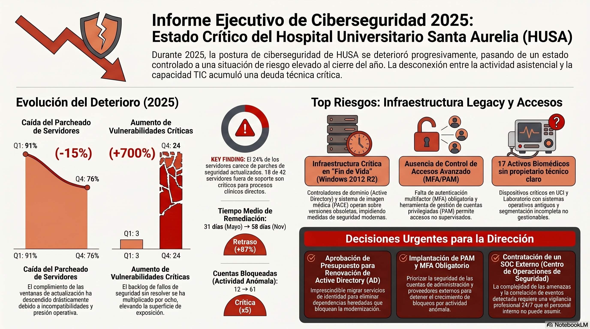
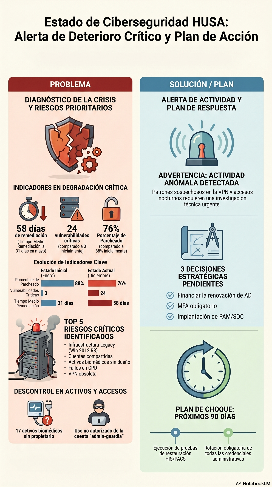
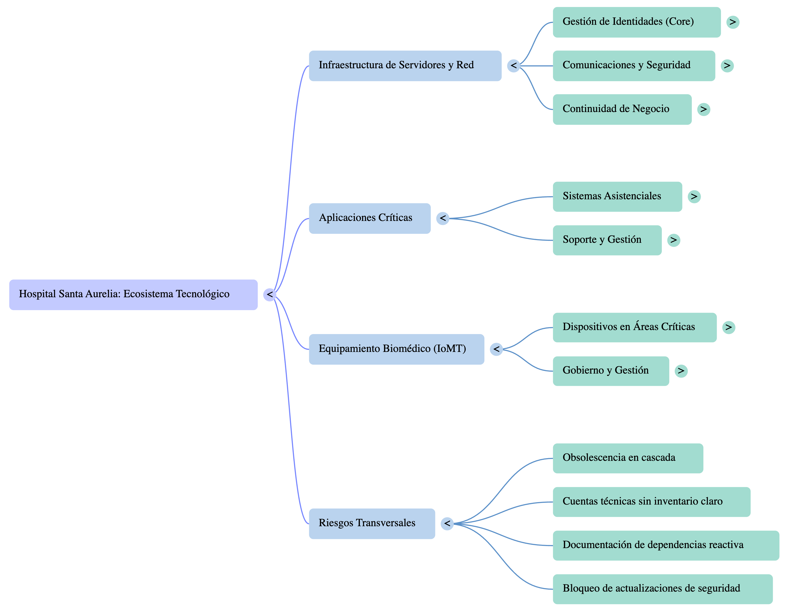

////
NO CAMBIAR!!
Codificación, idioma, tabla de contenidos, tipo de documento
////
:encoding: utf-8
:lang: es
:toc: right
:toc-title: Tabla de contenidos
:doctype: book
:linkattrs:
:icons: font

= Taller: Análisis de plan de ciberseguridad con NotebookLM
Inteligencia artificial generativa aplicada a productividad IT hospitalaria - Caso HUSA

:numbered!:

[abstract]
== Resumen

Este documento guía una sesión práctica sobre el uso de NotebookLM para preparar una Comisión Extraordinaria de Ciberseguridad a partir de documentación dispersa, parcialmente contradictoria y realista.

El caso de estudio es el **Hospital Universitario Santa Aurelia (HUSA)**, un hospital ficticio que convoca una comisión extraordinaria tras varios meses de señales preocupantes: retrasos de parcheado, vulnerabilidades acumuladas, Active Directory heredado, equipos biomédicos sin soporte, segmentación incompleta, accesos privilegiados inusuales y dependencia del proveedor externo.

El objetivo no es solo resumir documentos, sino aprender a **correlacionar señales, detectar contradicciones, reconstruir una cronología, separar hechos de inferencias y preparar una reunión directiva con evidencias trazables**.

[IMPORTANT]
====
Todos los datos del caso son ficticios. No contienen datos reales de pacientes ni información real de ningún hospital.
====

.Objetivos de aprendizaje
Al finalizar la sesión, las personas participantes deberían ser capaces de:

* Importar un conjunto documental organizado en NotebookLM.
* Distinguir entre narrativa oficial, evidencias técnicas e inferencias.
* Formular preguntas útiles para preparar una comisión de ciberseguridad.
* Detectar riesgos prioritarios, decisiones abiertas, responsables y compromisos incumplidos.
* Identificar contradicciones sutiles entre actas, auditorías, KPIs, vulnerabilidades, inventarios, emails e incidencias.
* Reconstruir una línea temporal de deterioro progresivo.
* Reconocer señales tempranas de un posible incidente futuro sin afirmar más de lo que sostienen las evidencias.
* Preparar un briefing ejecutivo para Dirección TIC con trazabilidad de fuentes.
* Usar NotebookLM como apoyo al juicio profesional, no como sustituto de la responsabilidad técnica.

== Cómo usar este documento

Este documento sirve para tres usos:

* **Durante la clase presencial**: funciona como guion de la sesión, con temporización, actividades, preguntas, visualizaciones y recursos enlazados.
* **Durante la práctica guiada**: permite a cada participante acceder rápidamente a los documentos que se importarán en NotebookLM.
* **Después de la sesión**: permite repetir el ejercicio en remoto, reconstruir la narrativa y comparar resultados.

[NOTE]
====
La sesión está pensada para 90-120 minutos. Si se dispone de menos tiempo, se recomienda realizar solo las fases 1, 3, 5 y 6.
====

== Recursos del caso

Carpeta raíz del caso:

* link:./[ComisionCiberseguridad, window=_blank]

Documento reservado para la guía de la sesión:

* link:INSTRUCTOR_GUIDE.md[INSTRUCTOR_GUIDE.md, window=_blank]

[WARNING]
====
No cargar `INSTRUCTOR_GUIDE.md` en NotebookLM durante la práctica con asistentes. Contiene la historia real del escenario, la cronología completa, las contradicciones sembradas y las respuestas de validación.
====

=== Paquete recomendado para NotebookLM

Para la práctica principal se deben importar todos los documentos Markdown incluidos en estas carpetas:

* link:Actas/[Actas, window=_blank]
* link:Auditorias/[Auditorías, window=_blank]
* link:Vulnerabilidades/[Vulnerabilidades, window=_blank]
* link:Inventario/[Inventario, window=_blank]
* link:Incidencias/[Incidencias, window=_blank]
* link:Emails/[Emails, window=_blank]
* link:Planes/[Planes de acción, window=_blank]
* link:KPIs/[KPIs, window=_blank]

[TIP]
====
Si NotebookLM limita el número de fuentes disponibles en la cuenta usada en clase, empezar por: actas 06-12, auditorías Q2-Q4, auditoría externa, vulnerabilidades julio-octubre, inventario, emails, incidentes Q3-Q4, planes y KPIs. Esa selección conserva la mayor parte del valor analítico del ejercicio.
====

=== Acceso directo por documento

[cols="1,2,4", options="header"]
|===
| Bloque | Documento | Uso en la sesión

| Actas
| link:Actas/ACTA_COMISION_01.md[ACTA_COMISION_01.md, window=_blank] · link:Actas/ACTA_COMISION_02.md[ACTA_COMISION_02.md, window=_blank] · link:Actas/ACTA_COMISION_03.md[ACTA_COMISION_03.md, window=_blank]
| Arranque aparentemente controlado, primeras acciones y tono oficial prudente.

| Actas
| link:Actas/ACTA_COMISION_04.md[ACTA_COMISION_04.md, window=_blank] · link:Actas/ACTA_COMISION_05.md[ACTA_COMISION_05.md, window=_blank] · link:Actas/ACTA_COMISION_06.md[ACTA_COMISION_06.md, window=_blank]
| Primeros retrasos, MFA condicionado y dependencia de ventanas técnicas.

| Actas
| link:Actas/ACTA_COMISION_07.md[ACTA_COMISION_07.md, window=_blank] · link:Actas/ACTA_COMISION_08.md[ACTA_COMISION_08.md, window=_blank] · link:Actas/ACTA_COMISION_09.md[ACTA_COMISION_09.md, window=_blank]
| Verano con presión operativa, microsegmentación parcial y revisión de privilegios incompleta.

| Actas
| link:Actas/ACTA_COMISION_10.md[ACTA_COMISION_10.md, window=_blank] · link:Actas/ACTA_COMISION_11.md[ACTA_COMISION_11.md, window=_blank] · link:Actas/ACTA_COMISION_12.md[ACTA_COMISION_12.md, window=_blank]
| Cierre de año sin incidente declarado, pero con decisiones estratégicas todavía abiertas.

| Auditorías
| link:Auditorias/AUDITORIA_INTERNA_Q1.md[AUDITORIA_INTERNA_Q1.md, window=_blank] · link:Auditorias/AUDITORIA_INTERNA_Q2.md[AUDITORIA_INTERNA_Q2.md, window=_blank]
| Hallazgos tempranos: parcheado retrasado, cuentas privilegiadas, segmentación parcial y AD heredado.

| Auditorías
| link:Auditorias/AUDITORIA_INTERNA_Q3.md[AUDITORIA_INTERNA_Q3.md, window=_blank] · link:Auditorias/AUDITORIA_INTERNA_Q4.md[AUDITORIA_INTERNA_Q4.md, window=_blank]
| Repetición de hallazgos y elevación de criticidad a final de año.

| Auditorías
| link:Auditorias/AUDITORIA_EXTERNA_ANUAL.md[AUDITORIA_EXTERNA_ANUAL.md, window=_blank] · link:Auditorias/AUDITORIA_RGPD.md[AUDITORIA_RGPD.md, window=_blank]
| Lectura independiente, exceso de privilegios, trazabilidad insuficiente y riesgo agregado superior al reflejado en actas.

| Vulnerabilidades
| link:Vulnerabilidades/VULNERABILIDADES_ENERO.md[VULNERABILIDADES_ENERO.md, window=_blank] · link:Vulnerabilidades/VULNERABILIDADES_ABRIL.md[VULNERABILIDADES_ABRIL.md, window=_blank] · link:Vulnerabilidades/VULNERABILIDADES_JULIO.md[VULNERABILIDADES_JULIO.md, window=_blank] · link:Vulnerabilidades/VULNERABILIDADES_OCTUBRE.md[VULNERABILIDADES_OCTUBRE.md, window=_blank]
| Evolución cuantitativa del deterioro: criticidades, altas, medias y sistemas afectados.

| Inventario
| link:Inventario/SERVIDORES.md[SERVIDORES.md, window=_blank] · link:Inventario/APLICACIONES.md[APLICACIONES.md, window=_blank]
| Sistemas heredados, aplicaciones críticas, conectores antiguos y dependencias técnicas ocultas.

| Inventario
| link:Inventario/EQUIPOS_BIOMEDICOS.md[EQUIPOS_BIOMEDICOS.md, window=_blank] · link:Inventario/CUENTAS_PRIVILEGIADAS.md[CUENTAS_PRIVILEGIADAS.md, window=_blank]
| Biomédicos legacy, activos sin propietario, cuentas técnicas amplias y ausencia de PAM.

| Incidencias
| link:Incidencias/INCIDENTES_Q1.md[INCIDENTES_Q1.md, window=_blank] · link:Incidencias/INCIDENTES_Q2.md[INCIDENTES_Q2.md, window=_blank] · link:Incidencias/INCIDENTES_Q3.md[INCIDENTES_Q3.md, window=_blank] · link:Incidencias/INCIDENTES_Q4.md[INCIDENTES_Q4.md, window=_blank]
| Eventos aparentemente menores que adquieren valor al correlacionarse.

| Emails
| link:Emails/EMAIL_01.md[EMAIL_01.md, window=_blank] · link:Emails/EMAIL_02.md[EMAIL_02.md, window=_blank] · link:Emails/EMAIL_03.md[EMAIL_03.md, window=_blank]
| Advertencias tempranas, vulnerabilidades aceptadas como excepciones, cuentas técnicas y retraso de MFA.

| Emails
| link:Emails/EMAIL_04.md[EMAIL_04.md, window=_blank] · link:Emails/EMAIL_05.md[EMAIL_05.md, window=_blank] · link:Emails/EMAIL_06.md[EMAIL_06.md, window=_blank]
| Microsegmentación bloqueada, deterioro frente a actas y escalado de alertas correlacionadas.

| Planes
| link:Planes/PLAN_REMEDIACION_2025.md[PLAN_REMEDIACION_2025.md, window=_blank] · link:Planes/SEGUIMIENTO_PARCHES.md[SEGUIMIENTO_PARCHES.md, window=_blank]
| Acciones comprometidas, retrasos de parcheado, criticidades y servidores fuera de soporte.

| Planes
| link:Planes/PLAN_CONTINUIDAD.md[PLAN_CONTINUIDAD.md, window=_blank] · link:Planes/PLAN_MFA.md[PLAN_MFA.md, window=_blank]
| Continuidad no probada, MFA retrasado, VPN condicionada y decisiones de Dirección pendientes.

| KPIs
| link:KPIs/KPI_MAYO.md[KPI_MAYO.md, window=_blank] · link:KPIs/KPI_AGOSTO.md[KPI_AGOSTO.md, window=_blank] · link:KPIs/KPI_NOVIEMBRE.md[KPI_NOVIEMBRE.md, window=_blank]
| Deterioro medible: parcheado, SLA, remediación, revisión de privilegios, inventario y hallazgos.
|===

:numbered:

== Narrativa paulatina del caso

=== Fase 1: enero-febrero, situación aparentemente controlada

La historia comienza con un hospital que no ha sufrido ningún incidente grave. La comisión se activa de forma preventiva, con una percepción inicial de control razonable. Las actas comunican seguimiento, prioridades y acciones, pero sin transmitir alarma.

.Documentos clave
* link:Actas/ACTA_COMISION_01.md[ACTA_COMISION_01.md, window=_blank]
* link:Actas/ACTA_COMISION_02.md[ACTA_COMISION_02.md, window=_blank]
* link:Vulnerabilidades/VULNERABILIDADES_ENERO.md[VULNERABILIDADES_ENERO.md, window=_blank]
* link:Incidencias/INCIDENTES_Q1.md[INCIDENTES_Q1.md, window=_blank]

[NOTE]
====
En ciberseguridad, la ausencia de un incidente declarado no equivale a ausencia de riesgo. El ejercicio empieza con señales débiles, no con una crisis evidente.
====

=== Fase 2: marzo-abril, primeras señales técnicas

En marzo y abril aparecen los primeros síntomas documentados: parcheado con retraso, revisión incompleta de cuentas privilegiadas, segmentación parcial, actividad VPN no habitual y aumento de vulnerabilidades. La comisión todavía mantiene una lectura optimista.

.Documentos clave
* link:Actas/ACTA_COMISION_03.md[ACTA_COMISION_03.md, window=_blank]
* link:Actas/ACTA_COMISION_04.md[ACTA_COMISION_04.md, window=_blank]
* link:Auditorias/AUDITORIA_INTERNA_Q1.md[AUDITORIA_INTERNA_Q1.md, window=_blank]
* link:Vulnerabilidades/VULNERABILIDADES_ABRIL.md[VULNERABILIDADES_ABRIL.md, window=_blank]
* link:Emails/EMAIL_01.md[EMAIL_01.md, window=_blank]

.Highlight para clase
[IMPORTANT]
====
El primer giro del caso está en la diferencia entre "vulnerabilidad aceptada como excepción" y "vulnerabilidad realmente resuelta". Pedir a NotebookLM que distinga ambas cosas suele revelar la utilidad del cruce de fuentes.
====

=== Fase 3: mayo-junio, el riesgo deja de ser administrativo

Los KPIs de mayo muestran que la situación ya no es tan cómoda: baja el cumplimiento de parcheado, quedan criticidades abiertas y la revisión de cuentas privilegiadas sigue muy incompleta. En junio se rompe un compromiso importante: MFA no finaliza por incompatibilidades con Radiología y proveedores biomédicos.

.Documentos clave
* link:Actas/ACTA_COMISION_05.md[ACTA_COMISION_05.md, window=_blank]
* link:Actas/ACTA_COMISION_06.md[ACTA_COMISION_06.md, window=_blank]
* link:Auditorias/AUDITORIA_INTERNA_Q2.md[AUDITORIA_INTERNA_Q2.md, window=_blank]
* link:KPIs/KPI_MAYO.md[KPI_MAYO.md, window=_blank]
* link:Emails/EMAIL_02.md[EMAIL_02.md, window=_blank]
* link:Emails/EMAIL_03.md[EMAIL_03.md, window=_blank]
* link:Planes/PLAN_MFA.md[PLAN_MFA.md, window=_blank]

[TIP]
====
Aquí conviene pedir a NotebookLM que compare responsables, fechas comprometidas y estados reales. El valor no está en listar tareas, sino en detectar qué compromisos empiezan a deslizarse.
====

=== Fase 4: julio-agosto, acumulación operativa

Durante el verano se acumulan señales operativas: accesos privilegiados fuera de horario, bloqueos de cuentas técnicas, MFA parcial, actividad VPN anómala, segmentación clínica incompleta y equipos biomédicos con propietario dudoso. Ningún evento parece crítico por sí solo.

.Documentos clave
* link:Actas/ACTA_COMISION_07.md[ACTA_COMISION_07.md, window=_blank]
* link:Actas/ACTA_COMISION_08.md[ACTA_COMISION_08.md, window=_blank]
* link:Vulnerabilidades/VULNERABILIDADES_JULIO.md[VULNERABILIDADES_JULIO.md, window=_blank]
* link:KPIs/KPI_AGOSTO.md[KPI_AGOSTO.md, window=_blank]
* link:Incidencias/INCIDENTES_Q3.md[INCIDENTES_Q3.md, window=_blank]
* link:Emails/EMAIL_04.md[EMAIL_04.md, window=_blank]
* link:Inventario/EQUIPOS_BIOMEDICOS.md[EQUIPOS_BIOMEDICOS.md, window=_blank]
* link:Inventario/CUENTAS_PRIVILEGIADAS.md[CUENTAS_PRIVILEGIADAS.md, window=_blank]

[NOTE]
====
Buen punto para hablar de correlación. En una lectura aislada, cada documento parece defendible. Al cruzarlos, aparece un patrón de exposición acumulada.
====

=== Fase 5: septiembre-octubre, los problemas ya son recurrentes

Las auditorías repiten hallazgos. Las vulnerabilidades crecen. El inventario muestra sistemas heredados, activos sin propietario y cuentas privilegiadas con trazabilidad insuficiente. La comisión sigue usando un lenguaje de control, pero los datos técnicos sostienen una lectura más severa.

.Documentos clave
* link:Actas/ACTA_COMISION_09.md[ACTA_COMISION_09.md, window=_blank]
* link:Actas/ACTA_COMISION_10.md[ACTA_COMISION_10.md, window=_blank]
* link:Auditorias/AUDITORIA_INTERNA_Q3.md[AUDITORIA_INTERNA_Q3.md, window=_blank]
* link:Vulnerabilidades/VULNERABILIDADES_OCTUBRE.md[VULNERABILIDADES_OCTUBRE.md, window=_blank]
* link:Planes/SEGUIMIENTO_PARCHES.md[SEGUIMIENTO_PARCHES.md, window=_blank]
* link:Inventario/SERVIDORES.md[SERVIDORES.md, window=_blank]
* link:Inventario/APLICACIONES.md[APLICACIONES.md, window=_blank]

[IMPORTANT]
====
¿Qué cambia si dejamos de leer los eventos como incidencias independientes y los tratamos como una tendencia?
====

=== Fase 6: noviembre-diciembre, preparación de comisión extraordinaria

La auditoría RGPD y la auditoría externa anual consolidan la lectura: el riesgo agregado es mayor que el reflejado en las actas. SecureHealth solicita escalado por coincidencia temporal entre VPN, bloqueos de cuentas y actividad administrativa nocturna. No se debe afirmar que existe un ataque confirmado, pero sí que hay señales que justifican investigación urgente.

.Documentos clave
* link:Actas/ACTA_COMISION_11.md[ACTA_COMISION_11.md, window=_blank]
* link:Actas/ACTA_COMISION_12.md[ACTA_COMISION_12.md, window=_blank]
* link:Auditorias/AUDITORIA_RGPD.md[AUDITORIA_RGPD.md, window=_blank]
* link:Auditorias/AUDITORIA_INTERNA_Q4.md[AUDITORIA_INTERNA_Q4.md, window=_blank]
* link:Auditorias/AUDITORIA_EXTERNA_ANUAL.md[AUDITORIA_EXTERNA_ANUAL.md, window=_blank]
* link:KPIs/KPI_NOVIEMBRE.md[KPI_NOVIEMBRE.md, window=_blank]
* link:Incidencias/INCIDENTES_Q4.md[INCIDENTES_Q4.md, window=_blank]
* link:Emails/EMAIL_05.md[EMAIL_05.md, window=_blank]
* link:Emails/EMAIL_06.md[EMAIL_06.md, window=_blank]
* link:Planes/PLAN_CONTINUIDAD.md[PLAN_CONTINUIDAD.md, window=_blank]
* link:Planes/PLAN_REMEDIACION_2025.md[PLAN_REMEDIACION_2025.md, window=_blank]

[IMPORTANT]
====
El resultado esperado no es una alarma injustificada. Es un briefing prudente: qué evidencias existen, qué inferencias son razonables, qué decisiones siguen bloqueadas y qué preguntas debe formular Dirección.
====

== Visualizaciones de apoyo

=== Línea temporal del deterioro

[mermaid]
....
timeline
    title Evolución del riesgo de ciberseguridad en HUSA
    Enero : Situación aparentemente controlada
          : 3 vulnerabilidades críticas
          : Comisión extraordinaria inicia seguimiento
    Marzo : Auditoría Q1 detecta retrasos de parcheado
          : Cuentas privilegiadas sin revisión completa
          : VPN no habitual tratada como falso positivo
    Abril : Suben vulnerabilidades críticas
          : PACS, AD y laboratorio muestran repetición de hallazgos
    Mayo : KPI muestra deterioro inicial
         : SecureHealth advierte patrón de intentos fallidos
         : Revisión de privilegios insuficiente
    Junio : MFA no finaliza
          : AD heredado condiciona cambios
          : Fatiga de Sistemas aparece en email
    Julio : Acceso privilegiado fuera de horario
          : Vulnerabilidades críticas aumentan
    Agosto : Bloqueos de cuentas técnicas
           : Microsegmentación bloqueada por dependencias no mapeadas
           : KPI confirma deterioro
    Septiembre : VPN anómala desde dos países
               : Auditoría Q3 repite hallazgos
    Octubre : 24 criticidades abiertas
            : Intentos contra portal de proveedores
            : Parches y excepciones se acumulan
    Noviembre : RGPD detecta privilegios excesivos
              : KPI baja a 78% parcheado
              : Cuenta de guardia usada de madrugada
    Diciembre : SecureHealth pide escalado
              : Auditoría externa eleva riesgo agregado
              : Decisiones estratégicas siguen abiertas
....

=== Mapa de fuentes y señales

[mermaid]
....
graph TD
    A[Actas] --> B[Narrativa oficial prudente]
    C[Auditorías] --> D[Hallazgos repetidos y criticidad]
    E[Vulnerabilidades] --> F[Evolución técnica cuantitativa]
    G[KPIs] --> H[Tendencia de deterioro]
    I[Inventario] --> J[Legacy, propietarios y privilegios]
    K[Incidencias] --> L[Señales operativas aisladas]
    M[Emails] --> N[Preocupaciones reales y escalados]
    O[Planes] --> P[Compromisos retrasados]
    B --> Q[Briefing para Dirección]
    D --> Q
    F --> Q
    H --> Q
    J --> Q
    L --> Q
    N --> Q
    P --> Q
....

=== Cadena causal principal

[mermaid]
....
flowchart LR
    A[Deuda técnica y sistemas legacy] --> B[Parcheado condicionado]
    B --> C[Vulnerabilidades críticas abiertas]
    A --> D[Active Directory heredado]
    D --> E[MFA y privilegios condicionados]
    E --> F[VPN y cuentas técnicas con excepciones]
    A --> G[Biomédicos sin soporte]
    G --> H[Microsegmentación incompleta]
    C --> I[Riesgo acumulado superior al comunicado]
    F --> I
    H --> I
    I --> J[Señales tempranas de posible incidente futuro]
....

=== Evolución de indicadores

[cols="1,1,1,1,2", options="header"]
|===
| Indicador | Mayo | Agosto | Noviembre | Lectura

| Porcentaje parcheado
| 90%
| 84%
| 78%
| Deterioro progresivo del control operativo.

| Vulnerabilidades críticas abiertas
| 7
| 13
| 21
| La remediación no absorbe el crecimiento del riesgo.

| Cumplimiento SLA de remediación
| 83%
| 71%
| 62%
| El equipo pierde capacidad de cierre dentro de plazo.

| Tiempo medio de remediación
| 31 días
| 46 días
| 58 días
| Las acciones abiertas permanecen más tiempo expuestas.

| Cuentas privilegiadas revisadas
| 38%
| 43%
| 51%
| Mejora insuficiente para el nivel de riesgo.

| Activos inventariados con propietario
| 86%
| 81%
| 76%
| La calidad del inventario empeora al aflorar activos sin responsable.

| Hallazgos de auditoría pendientes
| 9
| 14
| 19
| Los hallazgos se acumulan en lugar de cerrarse.
|===

=== Semáforo de temas para la comisión

[cols="1,1,3,3", options="header"]
|===
| Tema | Estado | Evidencia | Pregunta de Dirección

| Parcheado y vulnerabilidades
| Rojo
| Vulnerabilidades julio-octubre, KPI noviembre, seguimiento de parches.
| ¿Qué criticidades se cierran en 30 días y cuáles quedan formalmente aceptadas por Dirección?

| Active Directory
| Rojo
| Auditorías Q2-Q4, inventario de servidores, planes de remediación.
| ¿Cuándo se aprueba la renovación y qué dependencias bloquean el cambio?

| MFA y VPN
| Rojo
| PLAN_MFA, EMAIL_03, incidentes Q3-Q4.
| ¿Qué accesos siguen sin MFA obligatorio y por qué se mantienen?

| Privilegios y PAM
| Rojo
| CUENTAS_PRIVILEGIADAS, AUDITORIA_RGPD, incidentes fuera de horario.
| ¿Qué cuentas deben retirarse, reducir permisos o pasar a PAM de forma inmediata?

| Equipamiento biomédico legacy
| Ámbar/Rojo
| EQUIPOS_BIOMEDICOS, auditoría Q3, emails de segmentación.
| ¿Qué activos no tienen propietario y qué riesgo asistencial impide aislarlos?

| Microsegmentación
| Ámbar/Rojo
| EMAIL_04, auditorías, planes de remediación.
| ¿Qué segmentos clínicos pueden cerrarse ya y qué dependencias faltan?

| Continuidad
| Ámbar
| PLAN_CONTINUIDAD, AUDITORIA_INTERNA_Q4.
| ¿Por qué no se ha ejecutado la prueba de restauración completa?

| SOC externo y proveedor
| Ámbar/Rojo
| AUDITORIA_EXTERNA_ANUAL, emails de SecureHealth.
| ¿Qué cubre realmente SecureHealth y qué sigue quedando sin monitorización efectiva?
|===

== Temporización de la sesión

=== Versión de 120 minutos

[cols="1,2,4,3", options="header"]
|===
| Minuto | Bloque | Actividad | Resultado esperado

| 0-10
| Contexto
| Presentar el caso, reglas de privacidad, objetivo de NotebookLM y advertencia sobre `INSTRUCTOR_GUIDE.md`.
| Los asistentes entienden que trabajan con documentación ficticia pero realista.

| 10-25
| Preparación
| Importar documentos en NotebookLM, excluyendo `INSTRUCTOR_GUIDE.md`.
| NotebookLM queda listo con fuentes organizadas.

| 25-40
| Lectura inicial
| Pedir un resumen del estado de ciberseguridad para Dirección TIC.
| Se observa si NotebookLM reproduce la narrativa oficial o detecta deterioro.

| 40-60
| Evolución
| Reconstruir cronología enero-diciembre con evidencias.
| Aparece el deterioro gradual y los puntos de inflexión.

| 60-80
| Riesgos y contradicciones
| Preguntar por riesgos actuales, contradicciones y compromisos incumplidos.
| NotebookLM debe citar fuentes cruzadas.

| 80-100
| Incidente fantasma
| Pedir tendencias emergentes no tratadas explícitamente como incidente.
| Se formula una hipótesis prudente, sin afirmar ataque confirmado.

| 100-115
| Preparación de comisión
| Generar briefing, agenda y preguntas para SecureHealth.
| Se obtiene material accionable para Dirección.

| 115-120
| Cierre
| Comparar con `INSTRUCTOR_GUIDE.md` y extraer aprendizajes transferibles.
| Checklist de uso responsable.
|===

=== Versión compacta de 60 minutos

[cols="1,2,4", options="header"]
|===
| Minuto | Bloque | Actividad

| 0-10
| Contexto
| Presentación del caso y carga de fuentes.

| 10-25
| Primer análisis
| Resumen ejecutivo y estado real de ciberseguridad.

| 25-40
| Cruce de fuentes
| Riesgos prioritarios, contradicciones y decisiones abiertas.

| 40-55
| Comisión
| Briefing para Dirección y preguntas a SecureHealth Consulting.

| 55-60
| Cierre
| Validación rápida con `INSTRUCTOR_GUIDE.md`.
|===

== Guion de práctica con NotebookLM

=== Preparación de fuentes

1. Crear un nuevo notebook llamado `HUSA - Comisión extraordinaria de ciberseguridad`.
2. Importar todos los documentos del caso salvo `INSTRUCTOR_GUIDE.md`.
3. Esperar a que NotebookLM procese las fuentes.
4. Revisar que las fuentes quedan reconocibles por carpeta o por nombre.

[TIP]
====
En clase conviene que el formador tenga un notebook ya preparado por si algún asistente tiene problemas de acceso o límite de fuentes.
====

=== Pregunta 1: resumen inicial

.Prompt sugerido
[source,text]
----
Resume el estado de ciberseguridad del Hospital Universitario Santa Aurelia para una persona de Dirección TIC que no ha leído la documentación. Indica estado general, riesgos principales, decisiones pendientes y evidencias documentales.
----

.Qué observar
* Si la respuesta se limita al tono prudente de las actas o incorpora auditorías, KPIs, vulnerabilidades y emails.
* Si separa situación oficial, evidencias técnicas e inferencias.
* Si evita afirmar que hay un ataque confirmado.

=== Pregunta 2: cronología

.Prompt sugerido
[source,text]
----
Reconstruye una línea temporal de enero a diciembre. Para cada mes, indica qué cambia en la situación de ciberseguridad, qué evidencia documental lo demuestra y si el riesgo mejora, empeora o permanece estable.
----

.Qué observar
* Si identifica mayo-junio como punto de inflexión.
* Si detecta julio-agosto como acumulación operativa.
* Si usa KPIs, incidentes, auditorías y emails, no solo actas.
* Si mantiene fechas concretas.

=== Pregunta 3: riesgos actuales

.Prompt sugerido
[source,text]
----
¿Cuáles son los principales riesgos actuales? Ordénalos por gravedad e indica para cada uno: impacto, probabilidad estimada, responsable, documentos donde se evidencia y acción recomendada para Dirección.
----

.Qué observar
* Si aparecen parcheado, AD, MFA/VPN, biomédicos, segmentación, privilegios, continuidad y dependencia del proveedor.
* Si detecta que algunos riesgos están repartidos en varios documentos.
* Si no confunde riesgo aceptado con riesgo resuelto.

=== Pregunta 4: decisiones abiertas

.Prompt sugerido
[source,text]
----
Identifica las decisiones estratégicas que siguen abiertas. Para cada una, explica qué riesgo mantiene vivo, qué responsables aparecen asociados y qué documentos demuestran que sigue pendiente.
----

.Qué observar
* MFA obligatorio.
* Renovación Active Directory.
* Implantación PAM.
* SOC externo.
* Microsegmentación.
* Sustitución VPN.
* Gestión de dispositivos biomédicos legacy.

=== Pregunta 5: contradicciones documentales

.Prompt sugerido
[source,text]
----
Busca contradicciones o tensiones entre documentos. No te limites a contradicciones literales: incluye diferencias de tono, cifras que no encajan, compromisos que cambian, riesgos suavizados en actas y problemas que aparecen solo en emails, auditorías o KPIs.
----

.Qué observar
* Actas optimistas frente a KPIs en deterioro.
* Vulnerabilidades declaradas como excepciones frente a criticidades abiertas.
* Inventario supuestamente controlado frente a activos biomédicos sin propietario.
* MFA previsto en junio frente a retraso documentado.
* Segmentación presentada como avance frente a dependencias no mapeadas.

=== Pregunta 6: incidente fantasma

.Prompt sugerido
[source,text]
----
Observa los documentos como si estuvieras preparando una comisión de ciberseguridad. ¿Hay alguna tendencia emergente que no esté siendo tratada explícitamente como incidente? Separa hechos, inferencias e hipótesis, y cita las fuentes.
----

.Qué observar
* Si relaciona VPN, bloqueos de cuentas, actividad nocturna, cuentas privilegiadas y vulnerabilidades abiertas.
* Si formula una hipótesis prudente.
* Si evita convertir señales tempranas en certeza de ataque.

=== Pregunta 7: briefing para comisión

.Prompt sugerido
[source,text]
----
Prepara un briefing de una página para la Comisión Extraordinaria de Ciberseguridad. Debe incluir: estado real, riesgos prioritarios, contradicciones relevantes, decisiones que debe tomar Dirección, preguntas a SecureHealth Consulting y tres acciones para los próximos 90 días. Usa tono ejecutivo y cita evidencias.
----

.Qué observar
* Si produce una salida accionable y no solo descriptiva.
* Si prioriza con criterio.
* Si distingue acciones urgentes de decisiones estratégicas.

=== Pregunta 8: preguntas al proveedor

.Prompt sugerido
[source,text]
----
Actúa como Ana Beltrán. Prepara 10 preguntas exigentes para SecureHealth Consulting antes de cerrar la comisión. Cada pregunta debe indicar qué documento, alerta o contradicción la justifica.
----

.Qué observar
* Preguntas sobre cobertura real de SIEM.
* Evidencias del escalado de diciembre.
* Activos no monitorizados.
* Priorización de criticidades.
* Responsabilidades del proveedor frente a responsabilidades internas.
* Limitaciones para confirmar o descartar actividad hostil.

== Dinámicas de sesión

=== Dinámica A: actas frente a evidencias técnicas

Dividir la clase en dos grupos:

* Grupo 1: solo revisa actas.
* Grupo 2: revisa auditorías, vulnerabilidades, KPIs, emails e incidentes.

Cada grupo prepara en 10 minutos una respuesta a: "¿Está controlada la situación de ciberseguridad?".

[NOTE]
====
La discusión posterior permite mostrar que la calidad del análisis depende de las fuentes incluidas y de la pregunta formulada. Las actas no mienten necesariamente, pero sí pueden suavizar el riesgo agregado.
====

=== Dinámica B: comisión extraordinaria simulada

Roles sugeridos:

* Ana Beltrán: Directora TIC.
* Carlos Navarro: Responsable de Seguridad.
* Javier Ruiz: Responsable de Infraestructura.
* Laura Moreno: Responsable de Sistemas.
* Pablo Martín: Responsable de Redes.
* Marta Sánchez: Responsable de Continuidad.
* David Vega: SecureHealth Consulting.
* Raúl Ortega: Auditor externo.

Cada persona usa NotebookLM para preparar su posición. Después se simula una reunión de 20 minutos con cuatro objetivos:

* Decidir si MFA, PAM y renovación de AD se aprueban como prioridad inmediata.
* Acordar qué vulnerabilidades y excepciones se elevan a Dirección.
* Determinar qué debe entregar SecureHealth en 7 días.
* Definir si se abre una investigación técnica formal por las señales correlacionadas.

=== Dinámica C: auditoría de respuesta de IA

Pedir a NotebookLM un briefing y revisar:

* Qué afirmaciones están citadas.
* Qué afirmaciones son inferencias.
* Qué información importante falta.
* Qué contradicciones no ha detectado.
* Qué documentos ha usado en exceso y cuáles ha ignorado.
* Qué preguntas adicionales habría que formular.

[IMPORTANT]
====
Una buena práctica profesional es no aceptar el primer resumen. La utilidad aparece al iterar: pedir evidencias, contradicciones, incertidumbres, responsables, cronología y acciones.
====

== Material para asistentes remotos

=== Recorrido autónomo recomendado

1. Leer este documento completo.
2. Abrir la carpeta link:./[ComisionCiberseguridad, window=_blank].
3. Revisar primero las actas `ACTA_COMISION_01.md` a `ACTA_COMISION_12.md`.
4. Revisar las auditorías en orden: Q1, Q2, Q3, Q4, RGPD y auditoría externa anual.
5. Revisar vulnerabilidades de enero, abril, julio y octubre para ver la progresión técnica.
6. Revisar inventario para localizar sistemas heredados, biomédicos legacy y cuentas privilegiadas.
7. Revisar KPIs, planes, incidencias y emails para detectar la tendencia oculta.
8. Importar las fuentes en NotebookLM, excluyendo `INSTRUCTOR_GUIDE.md`.
9. Ejecutar los prompts del apartado "Guion de práctica".
10. Comparar los resultados con `INSTRUCTOR_GUIDE.md` al final, no antes.

=== Resultado que debe producir cada asistente

Cada asistente remoto debería terminar con cuatro artefactos:

* Un resumen ejecutivo de máximo una página.
* Una tabla de riesgos y decisiones abiertas.
* Una cronología de deterioro con evidencias.
* Una lista de preguntas para la comisión y para SecureHealth Consulting.

=== Checklist de calidad

[cols="1,4", options="header"]
|===
| OK | Criterio

| ☐
| El resumen diferencia claramente estado oficial, estado técnico e inferencias.

| ☐
| Las conclusiones citan documentos concretos.

| ☐
| Aparecen al menos seis decisiones abiertas.

| ☐
| Aparecen riesgos de parcheado, identidad, red, biomédicos, continuidad y proveedor.

| ☐
| Se identifican contradicciones entre actas, auditorías, KPIs, vulnerabilidades, inventario y emails.

| ☐
| La respuesta evita afirmar que hay un ataque confirmado.

| ☐
| La hipótesis sobre señales emergentes está formulada con prudencia.

| ☐
| Las preguntas al proveedor son verificables y no genéricas.
|===

== Highlights

[WARNING]
====
Esta sección contiene pistas de solución. Puede mostrarse al final de la sesión, no al inicio.
====

=== Pistas que deberían emerger

* La situación no empeora de golpe: se deteriora por acumulación.
* Las actas presentan una visión más optimista que los datos técnicos.
* El parcheado retrasado es el hilo más visible, pero no el único.
* Active Directory heredado condiciona MFA, privilegios, PACS, laboratorio y autenticación.
* Los equipos biomédicos legacy añaden un riesgo difícil de cerrar por dependencia asistencial y de fabricante.
* La segmentación incompleta convierte problemas locales en riesgo transversal.
* Las cuentas privilegiadas y técnicas son una pieza clave del escenario.
* SecureHealth advierte señales, pero el hospital depende demasiado del proveedor para operar y correlacionar.
* Los eventos aislados de VPN, bloqueos y actividad nocturna pueden anticipar un incidente futuro.
* La respuesta profesional correcta debe hablar de hipótesis e investigación, no de ataque confirmado.

=== Contradicciones que conviene hacer visibles

[cols="2,2,3", options="header"]
|===
| Versión oficial | Evidencia alternativa | Lectura

| Situación controlada o gestionable.
| KPIs, auditorías y vulnerabilidades muestran deterioro.
| El tono de acta infravalora el riesgo agregado.

| Vulnerabilidades cerradas o aceptadas como excepción.
| Informes técnicos mantienen criticidades abiertas durante meses.
| Aceptar una excepción no equivale a remediar.

| MFA previsto para junio.
| EMAIL_03 y PLAN_MFA documentan retrasos por incompatibilidades.
| Un compromiso estratégico queda abierto.

| Inventario y propietarios bajo control.
| EQUIPOS_BIOMEDICOS conserva 17 activos sin responsable confirmado.
| El gobierno de activos no está cerrado.

| Segmentación en avance.
| EMAIL_04 indica tráfico clínico sin propietario ni mapa de dependencias.
| La microsegmentación real está bloqueada.

| Eventos tratados como aislados.
| INCIDENTES_Q3, INCIDENTES_Q4 y EMAIL_06 muestran coincidencias temporales.
| Hay una tendencia emergente que requiere investigación.
|===

== Otras funcionalidades de NotebookLM a destacar

Hasta este punto la sesión se ha centrado en el uso conversacional de NotebookLM: preguntar, contrastar, reconstruir y preparar decisiones. Conviene reservar un bloque final para mostrar que la herramienta también puede producir **artefactos visuales y estructurados** que facilitan la comunicación con perfiles distintos.

La idea no es considerar NotebookLM como una herramienta de diseño final, sino ver cómo puede ayudar a transformar un análisis documental en materiales de apoyo para Dirección, mapas de comprensión compartida y tablas de trabajo reutilizables.

[NOTE]
====
Este bloque puede hacerse en 15-20 minutos si se dispone de una sesión larga. En la versión compacta, se recomienda mostrar solo la tabla consolidada de riesgos.
====

=== Infografía para Dirección

La infografía sirve para convertir el análisis complejo en una pieza ejecutiva. Es especialmente útil cuando la audiencia no necesita leer todos los documentos, pero sí entender por qué la comisión debe tomar decisiones.

.Cuándo mostrarlo
* Después de obtener el briefing ejecutivo.
* Antes de la dinámica de comisión simulada.
* Como cierre visual para resumir riesgo, tendencia y decisiones pendientes.

.Fuentes recomendadas
* link:KPIs/KPI_MAYO.md[KPI_MAYO.md, window=_blank]
* link:KPIs/KPI_AGOSTO.md[KPI_AGOSTO.md, window=_blank]
* link:KPIs/KPI_NOVIEMBRE.md[KPI_NOVIEMBRE.md, window=_blank]
* link:Auditorias/AUDITORIA_EXTERNA_ANUAL.md[AUDITORIA_EXTERNA_ANUAL.md, window=_blank]
* link:Vulnerabilidades/VULNERABILIDADES_OCTUBRE.md[VULNERABILIDADES_OCTUBRE.md, window=_blank]
* link:Emails/EMAIL_06.md[EMAIL_06.md, window=_blank]
* link:Planes/PLAN_REMEDIACION_2025.md[PLAN_REMEDIACION_2025.md, window=_blank]

.Primer prompt
[source,text]
----
Genera una infografía ejecutiva para Dirección TIC sobre la Comisión Extraordinaria de Ciberseguridad del HUSA.
----

El resultado ya es notable, como muestra la figura siguiente. Sin embargo, conviene pedir una segunda versión con esta instrucción

.Prompt mejorado
[source,text]
----
Genera una infografía ejecutiva para Dirección TIC sobre la Comisión Extraordinaria de Ciberseguridad del HUSA.

Debe incluir:
1. Mensaje principal en una frase.
2. Tres indicadores de deterioro.
3. Cinco riesgos prioritarios.
4. Tres decisiones que Dirección debe tomar.
5. Una advertencia sobre señales emergentes, formulada con prudencia y sin afirmar que exista un ataque confirmado.
6. Una recomendación de próximos 90 días.

Usa lenguaje ejecutivo, claro y visual. Cita las fuentes en las que se apoya cada bloque.
----

.Qué observar
* Si la infografía evita el detalle excesivo y selecciona pocos mensajes.
* Si mantiene prudencia en la parte de señales emergentes.
* Si usa KPIs y auditorías para sostener la narrativa, no solo actas.
* Si las decisiones aparecen formuladas como decisiones de Dirección, no como tareas técnicas sueltas.

Como se puede observar en la figura siguiente, la segunda versión es más clara, concreta y accionable, con un mensaje principal contundente, indicadores que muestran la tendencia, riesgos que explican el escenario y decisiones formuladas como decisiones de Dirección.

.Resultado esperado
[cols="1,3", options="header"]
|===
| Bloque de la infografía | Contenido esperado

| Mensaje principal
| HUSA no ha declarado un incidente grave, pero el riesgo agregado de ciberseguridad aumenta y exige decisiones inmediatas.

| Indicadores
| Parcheado baja del 90% al 78%; criticidades suben de 7 a 21; hallazgos pendientes suben de 9 a 19.

| Riesgos
| Parcheado, Active Directory heredado, MFA/VPN, privilegios, biomédicos legacy y segmentación incompleta.

| Decisiones
| MFA obligatorio, PAM, renovación de Active Directory, microsegmentación y gobierno de biomédicos legacy.

| Advertencia
| Hay señales correlacionadas de VPN, bloqueos y actividad nocturna que justifican investigación técnica.
|===

[TIP]
====
Si NotebookLM genera una pieza demasiado genérica, pedir una segunda versión con esta instrucción: "reduce el texto un 40%, usa solo datos citados y convierte cada bloque en un mensaje accionable".
====

=== Mapa mental del ecosistema tecnológico

El mapa mental permite visualizar la complejidad técnica del hospital sin empezar por las incidencias. Es una buena forma de que perfiles no especializados entiendan por qué una decisión aparentemente simple, como activar MFA o segmentar una red, arrastra dependencias con aplicaciones, servidores, biomédicos y cuentas técnicas.

En esta actividad no conviene usar todas las fuentes. El objetivo es representar el ecosistema tecnológico, no todo el expediente de riesgos.

.Fuentes que deben seleccionarse
* link:Inventario/APLICACIONES.md[APLICACIONES.md, window=_blank]
* link:Inventario/EQUIPOS_BIOMEDICOS.md[EQUIPOS_BIOMEDICOS.md, window=_blank]
* link:Inventario/SERVIDORES.md[SERVIDORES.md, window=_blank]

[IMPORTANT]
====
Seleccionar solo estas fuentes ayuda a que el mapa mental sea legible. Si se incluyen auditorías, emails e incidencias desde el principio, el mapa tiende a mezclarse con el análisis de riesgo y pierde claridad estructural.
====

.Paso 1: generar una versión textual
[source,text]
----
Usando solo las fuentes seleccionadas de aplicaciones, equipos biomédicos y servidores, genera un mapa mental textual del ecosistema tecnológico del Hospital Universitario Santa Aurelia.

Organízalo en:
1. Sistemas clínicos principales.
2. Infraestructura base.
3. Equipamiento biomédico.
4. Dependencias técnicas.
5. Cuentas o conectores relevantes.
6. Puntos críticos de riesgo o fragilidad.

No hagas todavía una conclusión ejecutiva. Quiero una estructura clara que pueda convertirse en nota.
----

.Paso 2: convertir la respuesta en nota
Tras obtener la respuesta textual, convertirla en una nota dentro de NotebookLM. Esta nota funciona como una fuente sintética, construida a partir del inventario, que resume el ecosistema sin introducir todavía la narrativa completa de riesgo.

.Paso 3: convertir la nota en fuente
Añadir la nota como fuente del notebook. De este modo NotebookLM puede trabajar sobre una representación más compacta y estructurada del ecosistema.

.Paso 4: pedir el mapa mental gráfico
[source,text]
----
A partir de la fuente creada con el mapa mental textual, genera un mapa mental gráfico del ecosistema tecnológico del HUSA.

El nodo central debe ser "Ecosistema tecnológico HUSA".
Debe mostrar aplicaciones clínicas, servidores críticos, equipos biomédicos, dependencias técnicas y puntos de fragilidad.
Destaca visualmente los elementos legacy, las dependencias con Active Directory, los activos sin propietario y los sistemas que condicionan MFA o segmentación.
----

.Qué observar
* Si el mapa separa aplicaciones, servidores y biomédicos.
* Si aparecen AD01/AD02 como dependencia transversal.
* Si PACS, laboratorio, farmacia, VPN y backup quedan conectados con sus dependencias.
* Si los biomédicos legacy aparecen como un bloque específico, no como un detalle lateral.
* Si se entiende la complejidad sin necesidad de leer todos los documentos.

El mapa mental ayuda a explicar por qué la comisión no puede resolver el caso con una sola decisión. El problema no es "parchear más" o "activar MFA" de forma aislada; el problema es un ecosistema con dependencias heredadas, conectores antiguos, equipos sin soporte, redes parcialmente segmentadas y cuentas privilegiadas que atraviesan varios dominios.

=== Tabla consolidada de riesgos

La tabla de datos es el artefacto más útil para pasar del análisis a la gestión. Permite convertir la conversación con NotebookLM en una matriz revisable por un equipo de Seguridad, Dirección TIC o una comisión.

.Cuándo mostrarlo
* Después de las preguntas sobre riesgos y decisiones abiertas.
* Antes de preparar el briefing final.
* Como base para asignar responsables y próximos pasos.

Se puede comenzar con un prompt sencillo, como el siguiente, y luego pedir iteraciones para mejorar la estructura, añadir columnas o incluir información que falte.

.Prompt inicial
[source,text]
----
Genera una tabla consolidada de riesgos de ciberseguridad del HUSA.
----

Si el resultado es demasiado simple, se puede pedir una segunda versión con esta instrucción:

.Prompt sugerido
[source,text]
----
Genera una tabla consolidada de riesgos de ciberseguridad del HUSA.

Incluye estas columnas:
- ID
- Riesgo
- Descripción breve
- Evidencias documentales
- Sistemas o activos afectados
- Responsable principal
- Probabilidad
- Impacto
- Nivel de prioridad
- Decisión pendiente asociada
- Acción recomendada en los próximos 90 días
- Estado actual

Ordena la tabla por prioridad descendente. Usa solo información apoyada por las fuentes. Si una conclusión es inferida, indícalo explícitamente.
----

.Resultado esperado
[cols="1,2,3,2,2,2,2", options="header"]
|===
| ID | Riesgo | Evidencias | Activos | Responsable | Prioridad | Acción 90 días

| R-01
| Vulnerabilidades críticas y parcheado retrasado
| KPIs, vulnerabilidades julio-octubre, seguimiento de parches
| AD, PACS, laboratorio, VPN, biomédicos
| Laura Moreno / Carlos Navarro
| Alta
| Cerrar criticidades no excepcionadas y elevar excepciones a Dirección

| R-02
| Active Directory heredado
| Auditorías Q2-Q4, inventario de servidores
| HUSA-SRV-AD01, HUSA-SRV-AD02
| Javier Ruiz
| Alta
| Aprobar renovación y mapa de dependencias

| R-03
| MFA incompleto y VPN con excepciones
| PLAN_MFA, EMAIL_03, incidentes Q3-Q4
| HUSA-VPN-GW01, proveedores, perfiles técnicos
| Carlos Navarro / Pablo Martín
| Alta
| Implantar MFA obligatorio o sustituir VPN

| R-04
| Privilegios excesivos y trazabilidad incompleta
| CUENTAS_PRIVILEGIADAS, AUDITORIA_RGPD, incidentes fuera de horario
| HUSA-admin-guardia, cuentas técnicas, Domain Admins
| Carlos Navarro
| Alta
| Reducir privilegios e iniciar PAM

| R-05
| Biomédicos legacy y segmentación incompleta
| EQUIPOS_BIOMEDICOS, auditoría Q3, EMAIL_04
| UCI-MON, RX-EST, LAB-AUTO, QUIR-NAV
| Pablo Martín / Marta Sánchez
| Media/Alta
| Asignar propietarios y aislar segmentos priorizados
|===

.Qué observar
* Si NotebookLM asigna responsables coherentes con los documentos.
* Si mezcla evidencia documental con recomendaciones sin separarlas.
* Si identifica decisiones pendientes asociadas al riesgo.
* Si usa estados como "abierto", "retrasado", "parcial" o "pendiente", no cierres ficticios.

[TIP]
====
Una buena segunda iteración es pedir: "Añade una columna con nivel de confianza y otra con documentos que habría que revisar manualmente antes de tomar la decisión".
====

[IMPORTANT]
====
Estos artefactos no sustituyen la revisión crítica. Deben tratarse como borradores de trabajo: se validan contra fuentes, se refinan con prompts y se corrigen con criterio profesional.
====

== Conclusiones

NotebookLM resulta útil en este ejercicio porque permite trabajar con fuentes múltiples y mantener trazabilidad. Sin embargo, el aprendizaje central no es "la IA resume documentos", sino algo más profesional: **la IA ayuda a preparar mejores preguntas de seguridad**.

En un entorno IT hospitalario, preparar una comisión de ciberseguridad no consiste solo en saber qué ha pasado. Consiste en saber qué decisiones están bloqueadas, qué riesgos no se han dicho con claridad, qué compromisos deben verificarse, qué señales conviene correlacionar y qué fuentes sostienen cada afirmación.

[IMPORTANT]
====
La IA puede acelerar el análisis documental, pero la responsabilidad de interpretación, priorización y decisión sigue siendo humana.
====
