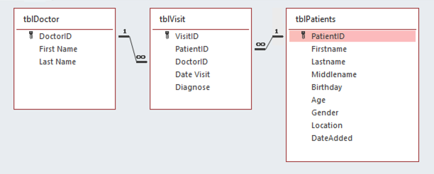
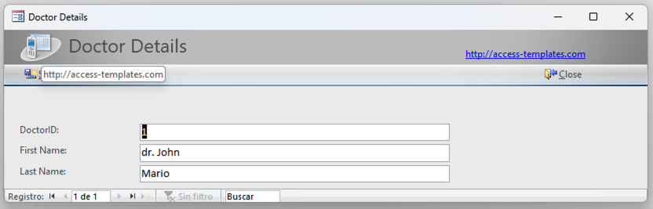
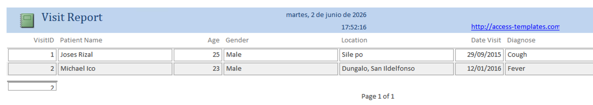
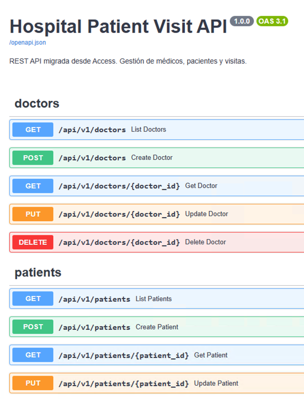
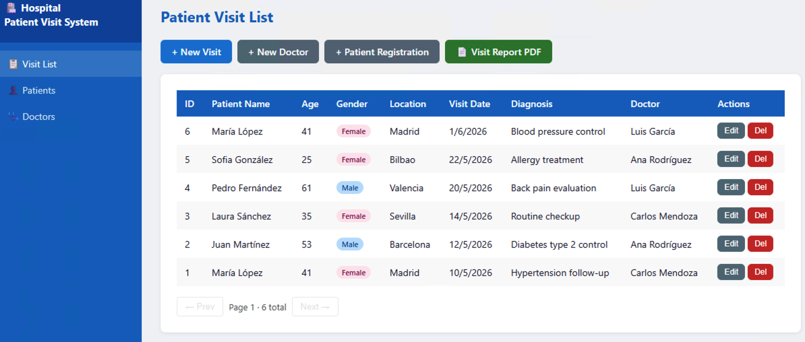

////
NO CAMBIAR!!
Codificación, idioma, tabla de contenidos, tipo de documento
////
:encoding: utf-8
:lang: es
:toc: right
:toc-title: Tabla de contenidos
:doctype: book
:linkattrs:

////
Nombre y título del trabajo
////

= IA generativa en la migración de aplicaciones Access
Inteligencia artificial generativa aplicada a productividad IT hospitalaria - Manuel Torres - Universidad de Almería

// NO CAMBIAR!! (Entrar en modo no numerado de apartados)
:numbered!: 

[abstract]
== Resumen
A medida que las orgsnizaciones se hacen grandes y cuentan con servicios corporativos complekos es habitual que se desarrollen serviicos a medida para cubrir necesidades específicas. Microsoft Access ha sido durante décadas la herramienta de referencia para este tipo de soluciones rápidas y a medida, pero su proliferación sin control genera riesgos operativos significativos. Este capítulo aborda cómo la inteligencia artificial generativa puede ser un aliado estratégico en la migración de aplicaciones Access hacia una arquitectura de servicios moderna, permitiendo a los equipos de TI hospitalarios transformar sus sistemas críticos con mayor agilidad, control y alineación con las necesidades reales del negocio. Se presentan casos de uso concretos, un proceso estructurado de migración y consideraciones específicas para el entorno hospitalario. Se presenta un enfoque estructurado para analizar las aplicaciones existentes, diseñar la arquitectura objetivo, formular prompts efectivos para la generación de código y validar los resultados. Además, se discuten consideraciones específicas para organizaciones  donde la proliferación de soluciones Access es común y representa un riesgo operativo significativo. El objetivo es mostrar cómo la IA puede ser un aliado estratégico en la transformación digital, permitiendo a los equipos de TI migrar sus sistemas críticos con mayor agilidad y control.

////
COLOCA A CONTINUACION LOS OBJETIVOS
////
.Objetivos
* Entender los riesgos operativos asociados a la proliferación de aplicaciones Access en organizaciones hospitalarias.
* Conocer los principios de una arquitectura de servicios moderna y cómo se aplica en el contexto hospitalario.
* Aprender a diseñar un proceso de migración de aplicaciones Access hacia servicios, con foco en la identificación de casos de uso, diseño de APIs y validación de resultados.
* Explorar cómo la inteligencia artificial generativa puede acelerar y mejorar el proceso de migración, desde el análisis de sistemas existentes hasta la generación de código y validación funcional.

// NO CAMBIAR!! (Entrar en modo numerado de apartados)
:numbered: 

== El problema que nadie quiere reconocer

Existe una conversación que se repite, con ligeras variaciones, en casi cualquier organización de tamaño medio grande, especialmente si son públicas. En el contexto de un hospital podría ser algo parecido a esto:

_"¿Dónde están los datos del almacén de farmacia?"_

_"En el Excel del turno de noche... o puede que en la aplicación Access que hizo Juan antes de jubilarse."_

_"¿Y el de mantenimiento de equipos?"_

_"Eso lo lleva otro Access. Creo que solo Marta sabe abrirlo."_

Esta conversación, que en apariencia es anecdótica, resume uno de los problemas de gobernanza tecnológica más extendidos en organizaciones grandes: **la proliferación de soluciones de datos en silos**, construidas con herramientas de usuario final como Microsoft Access.

Access es, en muchos sentidos, una herramienta extraordinaria. Permite a alguien con conocimientos medios de informática crear en pocos días una aplicación funcional con formularios, consultas e informes. Esa accesibilidad es precisamente su mayor fortaleza... y la raíz de uno de los mayores dolores de cabeza tecnológicos de nuestro tiempo.

=== El inventario invisible

En un hospital de tamaño medio, con varios servicios clínicos, servicios centrales y unidades de soporte, no es extraño encontrar entre un número considerable de aplicaciones Access activas. No todas están documentadas. No todas podrían tener propietario-responsable identificado. Algunas podrian llevar años funcionando en el ordenador de un usuario o servicio concreto, sin que nadie más, o pocas personas, sepan exactamente qué hacen ni qué pasaría si ese ordenador se estropeara.

Pensemos en el inventario típico de una organización hospitalaria:

[cols="25,45,30", options="header"]
|===
| Servicio | Aplicación Access habitual | Riesgo de pérdida

| Farmacia | Gestión de caducidades y lotes de medicamentos | Crítico
| Laboratorio | Registro de muestras pendientes y alertas de valores | Crítico
| Mantenimiento | Parque de equipos y calendario de revisiones | Alto
| Recursos Humanos | Turnos, guardias y vacaciones del personal | Alto
| Dietética | Dietas especiales por planta y paciente ingresado | Medio
| Esterilización | Trazabilidad de material estéril por autoclave | Alto
| Docencia | Registro de rotaciones y evaluaciones de residentes | Medio
| Calidad | Seguimiento de incidencias y no conformidades | Alto
| Compras | Control de pedidos y seguimiento de proveedores | Medio
| Infección | Vigilancia epidemiológica y brotes nosocomiales | Crítico
|===

Ninguna de estas aplicaciones es un capricho. Cada una nació porque había una necesidad real que el sistema de información corporativo —el HIS, el ERP— no cubría de forma ágil. Access fue la solución al alcance de la mano.

El problema no es que existieran. El problema es lo que ocurre cuando llevan diez años existiendo y la capadidad de supervisión es limitada.

=== Los síntomas del desorden

Cuando el parque de aplicaciones Access crece sin control, los síntomas aparecen de forma gradual pero acumulativa:

**Datos que no se hablan entre sí.** El sistema de farmacia sabe que hay una alerta de caducidad para un medicamento. El sistema de mantenimiento sabe que el frigorífico donde se almacena ese medicamento tiene una revisión pendiente. Pero ninguno de los dos sistemas es consciente de la existencia del otro. Un profesional tiene que reconciliar esa información manualmente.

**Conocimiento atrapado en ficheros.** Una base de datos Access es, técnicamente, un fichero `.accdb` en algún servidor de ficheros o, peor aún, en el escritorio de un PC. Si ese fichero desaparece, los datos desaparecen con él. No hay copias de seguridad automatizadas. No hay auditoría. No hay trazabilidad de quién cambió qué y cuándo.

**Dependencia de personas, no de sistemas.** "Eso lo sabe María" es una frase que debería hacer sonar todas las alarmas en un departamento de TI. Cuando el funcionamiento de un proceso crítico depende del conocimiento no documentado de una persona, la organización es frágil.

**Escalabilidad cero.** Access está diseñado para un usuario o, en el mejor caso, para un pequeño equipo en red local. Cuando varias personas intentan acceder simultáneamente, los problemas de bloqueo, corrupción y rendimiento se vuelven habituales.

**Integración imposible.** Ninguna de estas aplicaciones Access tiene una API. No hay forma de que otro sistema consuma sus datos automáticamente. Cada integración requiere exportar ficheros, mover datos manualmente o construir soluciones frágiles basadas en ODBC o automatizaciones de Office.

NOTE: No se trata de que Access sea una mala herramienta. Se trata de que está diseñado para resolver problemas individuales, no para ser el núcleo de la gestión de datos de una organización compleja.

== La tentación del ecosistema: el caso Oracle

Llegados a este punto, la reflexión natural en muchas organizaciones —especialmente en el sector público y en grandes empresas con décadas de historia tecnológica— es mirar hacia los sistemas de gestión de bases de datos corporativas que ya tienen en casa.

Oracle ocupa una posición dominante en ese espacio. Es robusto, maduro, escalable y cuenta con décadas de optimización para cargas de trabajo transaccionales críticas. Y lo más relevante para esta conversación: muchas de las aplicaciones Access que mencionamos antes no almacenan sus datos en ficheros `.accdb` independientes, sino que están conectadas como frontends ligeros a una base de datos Oracle corporativa.

En ese escenario, Oracle ofrece una respuesta aparentemente natural a la proliferación de Access: su plataforma **APEX** (Application Express) junto con **ORDS** (Oracle REST Data Services).

=== APEX y ORDS: la promesa

La propuesta es atractiva. APEX permite construir aplicaciones web directamente sobre las tablas de Oracle, con formularios, informes y cuadros de mando, sin salir del ecosistema. ORDS añade una capa de servicios REST que expone esos datos para ser consumidos desde otras aplicaciones.

Es, en esencia, la misma promesa que hizo Access hace treinta años: _"construye sin programar, directamente sobre tus datos"_.

Y como Access, cumple esa promesa razonablemente bien... hasta cierto punto.

=== El techo de APEX

Para organizaciones con necesidades de personalización avanzada, interfaces de usuario modernas o integraciones complejas, APEX comienza a mostrar sus límites:

* La interfaz generada es funcional pero difícilmente competitiva con lo que los usuarios esperan de una aplicación web moderna.
* La lógica de negocio compleja acaba viviendo en paquetes PL/SQL, aumentando la dependencia de Oracle.
* Mover o replicar datos fuera del ecosistema Oracle requiere esfuerzo explícito.
* El coste de licenciamiento de Oracle puede ser un factor limitante para nuevos proyectos o para organizaciones que quieran evolucionar hacia la nube.

[IMPORTANT]
====
APEX y ORDS son herramientas valiosas, especialmente cuando ya hay inversión en Oracle y los datos viven ahí. El problema no es la herramienta: es convertirla en el único patrón de solución. Cambiar la dependencia de Access por la dependencia de APEX es cambiar un silo por otro silo, aunque el segundo sea más sofisticado.
====

La lección que hay que extraer de ambos casos —Access y APEX— es la misma: **la arquitectura importa más que la herramienta**. Lo que diferencia una solución mantenible de una deuda técnica acumulada no es si se usó Access, APEX o cualquier otro framework, sino si los datos y la lógica de negocio están accesibles de forma estándar, documentada e independiente del proveedor.

== La arquitectura que lo cambia todo: API First

La arquitectura API First es, en esencia, una declaración de principios: **los datos y la lógica de negocio deben ser accesibles a través de servicios bien definidos, independientemente de quién los consume**.

En lugar de construir una aplicación monolítica donde la interfaz de usuario, la lógica de negocio y el acceso a datos están entrelazados —como ocurre en Access o en APEX—, una arquitectura API First separa estas responsabilidades:

[mermaid]
....
flowchart TD

    subgraph CONSUMIDORES
        C1[Navegador web]
        C2[App móvil]
        C3[Otro servicio]
        C4[Excel / BI]
    end

    subgraph API["CAPA DE API"]
        A1[Servicios REST documentados con OpenAPI / Swagger]
        A2[Autenticación, autorización y auditoría]
        A3[Lógica de negocio y validaciones]
    end

    subgraph DATOS["CAPA DE DATOS"]
        D1[MySQL / PostgreSQL / Oracle / SQL Server]
        D2[Esquema limpio, relaciones, índices y copias de seguridad]
    end

    CONSUMIDORES -->|HTTP / REST / JSON| API
    API -->|SQL / ORM| DATOS
....

Las ventajas para una organización como un hospital son inmediatas:

* **La farmacia puede consultar los datos de mantenimiento.** Si ambos sistemas exponen APIs, un tercer servicio puede cruzar esa información automáticamente.
* **El cuadro de mando directivo puede consumir datos reales.** No exportaciones manuales de Access a Excel, sino llamadas en tiempo real a los servicios de cada área.
* **Cualquier interfaz puede acceder a los mismos datos.** Una aplicación web para el ordenador de enfermería, una app móvil para el médico en planta, un script de integración con el HIS: todos consumen el mismo servicio, con las mismas reglas de negocio.
* **Los datos tienen dueño y auditoría.** Cada operación pasa por la API, que puede registrar quién hizo qué y cuándo.

=== El mapa de servicios del hospital

Imaginemos cómo quedaría el mapa de servicios de un hospital mediano si cada una de las aplicaciones Access del inventario anterior se migrara a una arquitectura API First:

[mermaid]
----
flowchart TD

    P["PORTAL WEB / APP"]

    P --> F
    P --> L
    P --> M

    F["Servicio Farmacia API"]
    L["Servicio Laboratorio API"]
    M["Servicio Mantenimiento API"]

    F --> DBF["MySQL / PostgreSQL"]
    L --> DBL["MySQL / PostgreSQL"]
    M --> DBM["MySQL / PostgreSQL"]

    DBF --> G
    DBL --> G
    DBM --> G

    G["Bus de integración / API Gateway"]

    G --> HIS["HIS / Oracle / ERP (sistemas corporativos existentes)"]
----

Nótese algo importante: la arquitectura API First no obliga a deshacerse de Oracle o del HIS. Al contrario, estos sistemas corporativos se convierten en un servicio más del ecosistema. ORDS puede ser la capa REST de Oracle, exactamente igual que FastAPI lo es para un servicio nuevo sobre MySQL. Lo que cambia es que ningún sistema es el único punto de verdad para todo: **cada servicio es el dueño de su dominio**.

== El rol de la Inteligencia Artificial: arquitectura sin programación

Llegamos al punto más relevante para quien lidera la transformación digital de una organización sanitaria: ¿cómo se construye todo esto sin un equipo de veinte desarrolladores y dos años de presupuesto?

La respuesta, hasta hace muy poco, era que no se podía. Construir una API REST bien documentada, con su esquema de base de datos, su lógica de negocio y su interfaz web, requería perfil técnico senior y tiempo. Era un argumento poderoso para mantener Access —al menos _algo_ funcionaba.

La proliferación de asistentes de IA capaces de generar código de calidad cambia completamente este escenario.

=== Trabajar en la arquitectura, no en la programación

La clave está en entender qué ha cambiado realmente. La IA no elimina la necesidad de conocimiento técnico: lo redistribuye. El trabajo ya no consiste en _escribir_ código, sino en:

. **Analizar** el sistema existente y entender qué hace realmente.
. **Diseñar** la arquitectura objetivo: qué servicios existen, qué datos gestionan, cómo se relacionan.
. **Formular** las instrucciones precisas para que el agente IA genere el código correcto.
. **Validar** que lo generado cumple con los requisitos funcionales y de calidad.
. **Iterar** sobre los resultados hasta que el sistema se comporta como se espera.

Este perfil es más cercano al de un jefe de proyecto técnico o un arquitecto de software que al de un programador. Y es un perfil que existe —o puede desarrollarse— dentro de los equipos de TI hospitalarios.

[TIP]
====
La IA como copiloto de desarrollo no es un entorno _no-code_ en el sentido tradicional: el código existe y es real. Pero el profesional que dirige el proceso trabaja a nivel de diseño y validación, no de sintaxis. La frontera entre "técnico" y "programador" se difumina de forma muy productiva.
====

=== Un ejemplo concreto: de Access a servicio en un día

Para ilustrar lo que es posible hoy con esta aproximación, tomemos uno de los casos del inventario hospitalario: la aplicación de **trazabilidad de material estéril** del servicio de esterilización.

Esta aplicación típica de Access gestiona:

* El registro de cargas de autoclave (qué material, qué programa, a qué temperatura, durante cuánto tiempo).
* La asignación de lotes de material estéril a quirófanos y unidades.
* Las alertas de caducidad de material por lote.
* La trazabilidad hacia atrás: si hay un incidente, saber exactamente qué material estuvo en qué autoclave.

Con la aproximación tradicional, migrar esto a una arquitectura de servicios sería un proyecto de meses. Con un agente IA bien dirigido y los prompts adecuados, es posible tener un prototipo funcional —esquema de base de datos, API documentada y frontend operativo— en una jornada de trabajo.

El profesional de TI no programa. Analiza la aplicación Access, describe al agente lo que hace, valida que el esquema generado es correcto y prueba que la API funciona. El código lo genera la IA.

== Casos de uso hospitalarios: más allá de los registros básicos

La migración de aplicaciones Access en un hospital no es solo una cuestión técnica. Es una oportunidad de repensar cómo fluye la información en la organización. A continuación se presentan varios casos de uso reales, con su problemática actual en Access y el valor que aporta la migración a servicios.

=== Caso 1: Farmacia — Gestión de caducidades y lotes

==== La situación actual

El servicio de farmacia lleva en una base de datos Access el control de caducidades de medicamentos. El fichero vive en un PC de la farmacia. Cada semana, el farmacéutico de guardia abre la aplicación, genera un informe de lo que caduca en los próximos treinta días y lo imprime o envía por correo electrónico a los responsables de planta.

Si el PC falla, el informe no sale. Si el farmacéutico está de vacaciones, nadie más sabe cómo generarlo. Si farmacia quiere cruzar esa información con el sistema de pedidos para no pedir stock que va a caducar antes de consumirse, tiene que hacerlo manualmente con Excel.

==== El servicio migrado

Un servicio `farmacia-api` con los siguientes endpoints:

[source]
----
GET  /api/v1/medicamentos                    → Catálogo con stock actual
GET  /api/v1/lotes?caduca_antes=2026-07-01   → Alertas de caducidad
POST /api/v1/lotes/{id}/asignar-planta       → Asignar lote a unidad
GET  /api/v1/lotes/{id}/trazabilidad         → Historial completo del lote
GET  /api/v1/reports/caducidades/pdf         → El informe semanal, ahora automatizable
----

==== El valor añadido

El sistema de pedidos puede consultar automáticamente el endpoint de caducidades antes de generar una orden de compra. El cuadro de mando directivo puede mostrar en tiempo real el porcentaje de stock próximo a caducar. Las alertas pueden enviarse automáticamente por correo o al sistema de mensajería del hospital sin intervención manual.

---

=== Caso 2: Mantenimiento — Parque de equipos médicos

==== La situación actual

El servicio de mantenimiento gestiona en Access el inventario de equipos médicos: ecógrafos, monitores de constantes, desfibriladores, bombas de infusión. Para cada equipo, registra el número de serie, la fecha de última revisión, la fecha de próxima revisión obligatoria y el histórico de averías e intervenciones.

El problema crónico: cuando un equipo entra en avería, el clínico que lo detecta no tiene forma de saber si está en revisión programada, si ya tiene un parte de avería abierto o si hay un equipo de sustitución disponible. Esa información está en el Access de mantenimiento, al que solo accede el personal de ese servicio.

==== El servicio migrado

[source]
----
GET  /api/v1/equipos?ubicacion=UCI           → Equipos por unidad
GET  /api/v1/equipos/{id}/estado             → Estado actual (operativo/avería/revisión)
POST /api/v1/averias                          → Notificar avería desde cualquier unidad
GET  /api/v1/averias?estado=abierta          → Panel de averías pendientes
GET  /api/v1/equipos?revision_antes=30d      → Revisiones programadas próximas
PUT  /api/v1/averias/{id}/cerrar             → Cierre de intervención con causa y solución
----

==== El valor añadido

La pantalla de estado del equipo puede mostrarse en la tablet de la enfermería o en el propio equipo mediante un código QR. El sistema puede notificar automáticamente al servicio técnico del fabricante cuando un equipo crítico entra en avería. Los datos de averías repetidas pueden alimentar un análisis predictivo de vida útil del equipo.

---

=== Caso 3: Recursos Humanos — Turnicidad y guardias

==== La situación actual

Muchas unidades de enfermería llevan la planificación de turnos en Access o, directamente, en Excel. La complejidad es alta: turnos rotativos, guardias localizadas, compatibilidad con convenio colectivo, descansos obligatorios, sustituciones de última hora. El resultado es un fichero que solo entiende quien lo construyó y que es prácticamente imposible de auditar.

==== El servicio migrado

[source]
----
GET  /api/v1/turnos?unidad=urgencias&fecha=2026-07-01   → Turno del día
GET  /api/v1/profesionales/{id}/calendario               → Calendario personal
POST /api/v1/guardias                                    → Registrar guardia
GET  /api/v1/ausencias?tipo=baja&mes=2026-07             → Control de ausencias
GET  /api/v1/reports/horas-extra/pdf                     → Liquidación mensual
POST /api/v1/sustituciones                               → Gestión de sustituciones
----

==== El valor añadido

El profesional puede consultar su turno desde el móvil. El supervisor puede gestionar sustituciones de urgencia sin acceder a ningún fichero local. Los datos de horas extra pueden fluir automáticamente hacia el sistema de nóminas, eliminando la reconciliación manual.

---

=== Caso 4: Infección — Vigilancia epidemiológica

==== La situación actual

Este es quizás el caso donde el coste de tener los datos en un Access aislado es más alto. El servicio de medicina preventiva lleva el registro de microorganismos multirresistentes, brotes intrahospitalarios y tasas de infección por unidad en una base de datos Access. Para generar el informe mensual obligatorio para la Consejería de Salud, deben exportar datos, procesarlos en Excel y rellenar un formulario externo.

Si hay un brote en la UCI, la información sobre qué pacientes están afectados, en qué habitaciones y qué medidas están en curso vive en ese fichero Access, al que solo puede acceder el personal de infección desde sus propios ordenadores.

==== El servicio migrado

[source]
----
POST /api/v1/alertas-microbiologicas              → Alta de nuevo aislamiento
GET  /api/v1/alertas-microbiologicas?activa=true  → Mapa de aislamientos activos
GET  /api/v1/brotes/{id}                          → Detalle de brote en curso
GET  /api/v1/tasas?unidad=UCI&mes=2026-06          → Tasas de infección por unidad
GET  /api/v1/reports/informe-mensual/pdf           → Generación automática del informe
POST /api/v1/brotes/{id}/notificar-autoridades     → Notificación a Consejería (integración)
----

==== El valor añadido

El sistema puede alertar automáticamente a enfermería de planta cuando un paciente tiene un aislamiento activo, sin que tenga que consultar un sistema separado. El informe mensual se genera con un botón. La integración con los sistemas de vigilancia epidemiológica regionales puede automatizarse completamente.

---

=== Caso 5: Laboratorio — Gestión de muestras y alertas de pánico

==== La situación actual

El laboratorio tiene un sistema LIS (Laboratory Information System) corporativo para el proceso analítico principal. Pero hay un Access satélite que gestiona las muestras rechazadas por defectos preanalíticos (hemólisis, coagulación, volumen insuficiente), los avisos de valores de pánico y el control de tiempos de respuesta por tipo de prueba urgente.

Este Access es crítico: un valor de pánico no comunicado a tiempo puede tener consecuencias clínicas graves. Y actualmente, esa comunicación depende de que un técnico vea la alerta en la pantalla de un PC concreto.

==== El servicio migrado

[source]
----
POST /api/v1/valores-panico                        → Registrar valor de pánico
GET  /api/v1/valores-panico?comunicado=false       → Pendientes de comunicar
PUT  /api/v1/valores-panico/{id}/comunicado        → Confirmar comunicación con timestamp
GET  /api/v1/muestras-rechazadas?motivo=hemolisis  → Estadística de rechazos
GET  /api/v1/tiempos-respuesta?tipo=troponina      → KPIs de tiempo urgentes
----

==== El valor añadido

El servicio puede enviar una notificación push al médico responsable cuando se registra un valor de pánico, con confirmación de lectura. El registro de comunicación queda auditable con fecha, hora y receptor. Los KPIs de laboratorio son visibles en tiempo real para la dirección médica.

== El proceso de migración: de Access a servicio, paso a paso

Con fines ilustrativos, a continuación se muestra cómo llevar a cabo una migración con dos prompts de ejemplo. Se trata únicamente de una demostración con fines didácticos y está aplicado a una base de datos extramadamente sencilla (tres tablas, una consulta, formularios básicos y un informe). A continuación se muestra unas imágenes de la ventana de relaciones con la estructura de la base de datos, un formulario de ejemplo y el informe que se migrará.

Sobre esta base de datos lanzamos un primer prompt

[source]
----
Rol: Experto en Microsoft Access y desarrollo de sistemas de información, backend y frontend

Contexto: Aplicación corporativa en Access para gestión de pacientes.

Objetivo: Migrar a arquitectura de servicios, con backend en MySQL, servicios REST y frontend aparte.

Extrae la estructura de la base de datos, código SQL de las consultas, la lógica de los formularios y de los informes
----

Como se aprecia, es un prompt que aunque esté estructurado, es muy abierto. Aún asi, si lo lanzamos contra Claude Sonnet en modo agente, el resultado ya es bastante notable. Esto se debe a que el ejemplo es tan sencillo que la IA es capaz de inferir la mayoría de los detalles a partir de la información que se le da. En un caso real, con una base de datos más compleja, el resultado no sería tan perfecto a la primera, y se deberían usar prompts más específicos para cada parte del proceso, tal y como veremos más adelante. En este primer caso, los agentes encargados de implementar el plan elaborado por Claude generan una serie de scripts para interactuar con Access y obtener las tablas, consultas, formularios e informes. Claude pedirá en varias ocasiones permisos para interactuar con la terminal (desarrollo de scripts, ejecución de los mismos, validación de resultados) y el resultado final es un https://github.com/ualmtorres/AccessMigration/tree/main/extracted[inventario completo de lo que hay que migrar, window=_blank], con detalles de cada elemento. 

Una vez tenemos ese inventario, le pediremos que modifique el plan de migración propuesto para que sea un entorno Docker compose con MySQL, FastAPI y React, y que el resultado sea un sistema completo, listo para probar y desplegar.

[source]
----
Adapta el plan de migración para crear un despliegue de desarrollo con Docker compose. La base de datos será MySQL, el backend irá en FastAPI (con soporte OpenAPI) y el frontend será una SPA en React. 

Una vez adaptado, implmementa el plan de migración y comprueba que funcione todo.
----

Una vez finalizado, comprobamos que el resultado es un sistema completo, con la base de datos MySQL creada y poblada, el servicio FastAPI con los endpoints definidos y el frontend React operativo. Si hay algún detalle menor que corregir, se puede iterar con prompts adicionales para ajustar el resultado indicando lo que no funciona y pidiéndole que lo corrija.

Tras esto, tendremos:

* una API REST documentada con OpenAPI

* un frontend React con la información de los pacientes migrada desde Access.

Este ejemplo sólo es una demostración de lo que es posible hoy día (junio 2026) con las herramientas de IA generativa. No obstante, ha sido una demostración con un caso extremandamente sencillo. Por supuesto, no se trata hacer migraciones sin ningún tipo de intervención humana: el profesional de TI sigue siendo el responsable de dirigir el proceso, validar los resultados y tomar decisiones críticas. Pero sí muestra cómo la IA puede acelerar y facilitar cada etapa del proceso, permitiendo que una migración que antes era un proyecto de meses se convierta en una tarea de días.

.Planteamiento de una migración real: pasos a seguir
****
En una situación real, no se deben lanzar un par de prompts y esperar que ocurra la magia. A medida que el proyecto de migración es más complejo, la planificación y la gestión del proceso se vuelven críticas. Prompts vagos o genéricos dejan demasiado espacio a la interpretación de la IA, lo que puede derivar rápidamente en resultados incompletos e incorrectos, que además, crecen exponencialmente a medida que el proyecto se vuelve más grande. Por eso, es fundamental estructurar el proceso en etapas claras, con objetivos específicos y prompts diseñados para cada una de ellas. A continuación se muestra un posible esquema de etapas para una migración real:

. **Etapa 1: Análisis y extracción de información.** Extraer el esquema de tablas, consultas, formularios, informes y módulos VBA de la aplicación Access. Validar que el inventario es completo y correcto.
. **Etapa 2 (opcional): Diseño del nuevo esquema de datos.** En algunos casos, puede ser necesario rediseñar la estructura de datos para adaptarla a las necesidades actuales o para aprovechar mejor las capacidades de un sistema de gestión de bases de datos relacional.
. **Etapa 3: Implementación del backend.** Crear los endpoints funcionales y los adicionales indicando las reglas de negocio necesarias. Validar que el backend cumple con los requisitos funcionales y de calidad.
. **Etapa 4: Implementación del frontend.** Crear la interfaz de usuario que permita interactuar con el backend de forma intuitiva y eficiente. Se indicará la arquitectura de formularios e informes a migrar.
. **Etapa 5: Crear el entorno de desarrollo y despliegue.** Configurar un entorno de desarrollo local con Docker compose, que incluya la base de datos, el backend y el frontend, para facilitar las pruebas y la validación.
. **Etapa 6: Migración de datos.** Diseñar e implementar el proceso de migración de los datos existentes en Access a la nueva base de datos, asegurando la integridad y consistencia de los datos.

En https://github.com/ualmtorres/AccessMigration/tree/main/playbook[este playbook de ejemplo, window=_blank] se pueden encontrar una serie de pasos orientativos a seguir en un proceso de migración. Incluye un https://github.com/ualmtorres/AccessMigration/blob/main/playbook/03_structured_prompts.md[ejemplo de prompts estructurados, window=_blank] para cada etapa, con ejemplos concretos de cómo formular las instrucciones a la IA para obtener resultados útiles y precisos.
****

== Consideraciones para una organización hospitalaria

=== Seguridad y cumplimiento normativo

Los datos hospitalarios están sujetos a regulación estricta: RGPD, Ley Orgánica de Protección de Datos, normativa específica de historias clínicas. Una arquitectura de servicios bien diseñada mejora el cumplimiento respecto a Access:

* **Auditoría**: cada operación sobre los datos queda registrada con usuario, fecha y hora.
* **Control de acceso**: la API puede implementar autenticación y autorización granular (quién puede ver qué).
* **Cifrado en tránsito**: todas las comunicaciones a través de HTTPS, a diferencia de las conexiones ODBC en red local.
* **Copias de seguridad**: la base de datos MySQL tiene políticas de backup automatizadas, no un fichero `.accdb` en un disco sin replicar.

[WARNING]
====
Ningún servicio de datos sanitarios debe desplegarse en producción sin una revisión de seguridad que incluya al menos: autenticación de usuarios, cifrado en tránsito (HTTPS), y política de copias de seguridad verificada.
====

=== Integración con sistemas corporativos

Una de las preguntas más frecuentes es: ¿qué pasa con las aplicaciones Access que ya están conectadas a Oracle?

La respuesta es que la arquitectura API First es complementaria, no sustitutiva. Un servicio puede consultar datos de Oracle a través de ORDS y combinarlos con datos propios para ofrecer una respuesta integrada. La clave es que ese servicio tenga una API limpia y documentada hacia el exterior, independientemente de de dónde vengan sus datos internamente.

=== La gestión del cambio

El obstáculo más difícil en una migración no suele ser técnico: es humano. El profesional que lleva diez años usando una aplicación Access tiene un flujo de trabajo construido alrededor de ella. La interfaz web nueva, por más moderna que sea, es diferente.

Algunas recomendaciones:

* Involucrar a los usuarios clave en la definición de la nueva interfaz, no solo en la validación final.
* Mantener durante un período la aplicación Access en modo solo lectura, como red de seguridad, mientras los usuarios se familiarizan con la nueva herramienta.
* Documentar los cambios en términos de flujo de trabajo, no de tecnología.

'''

== Conclusión: una oportunidad estratégica

La acumulación de aplicaciones Access en una organización mediana-grande como un hospital  no es un problema de tecnología. Es un síntoma de una necesidad real que no fue atendida por los sistemas corporativos. Esa necesidad de agilidad, de soluciones a medida para problemas específicos, es legítima y debe satisfacerse.

La diferencia entre el parque de Access de hoy y la arquitectura de servicios de mañana no es que los usuarios dejen de tener herramientas a medida. Es que esas herramientas a medida estén construidas sobre cimientos sólidos: datos accesibles, auditables, integrables y seguros.

La Inteligencia Artificial hace que esa transición sea viable sin necesidad de grandes equipos de desarrollo. Un profesional técnico con capacidad analítica, conocimiento del negocio y habilidad para dirigir un agente IA puede construir en días lo que antes requería semanas de programación.

El resultado es una organización donde los datos del laboratorio, de farmacia, de mantenimiento y de infección no viven en ficheros aislados en PCs individuales, sino en servicios bien gobernados que pueden interoperar, integrarse y evolucionar. Una organización donde la información fluye, y donde el conocimiento crítico no depende de que Marta esté disponible.

